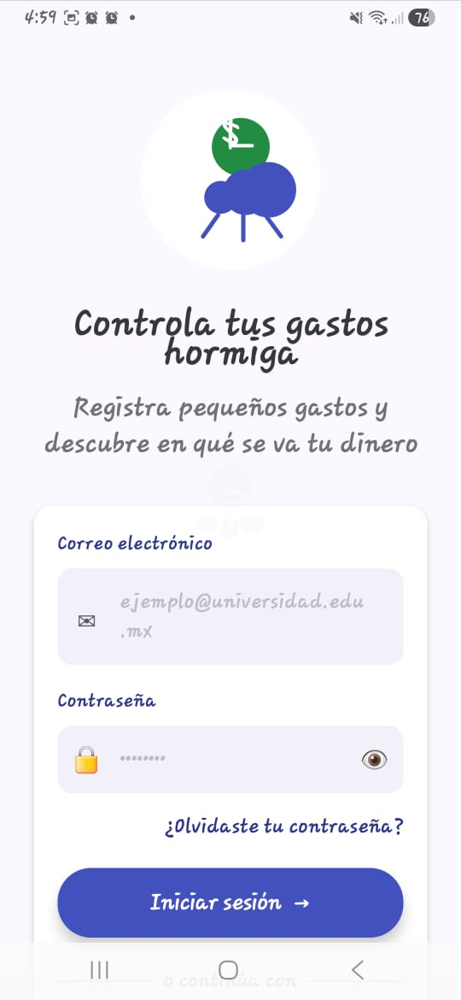
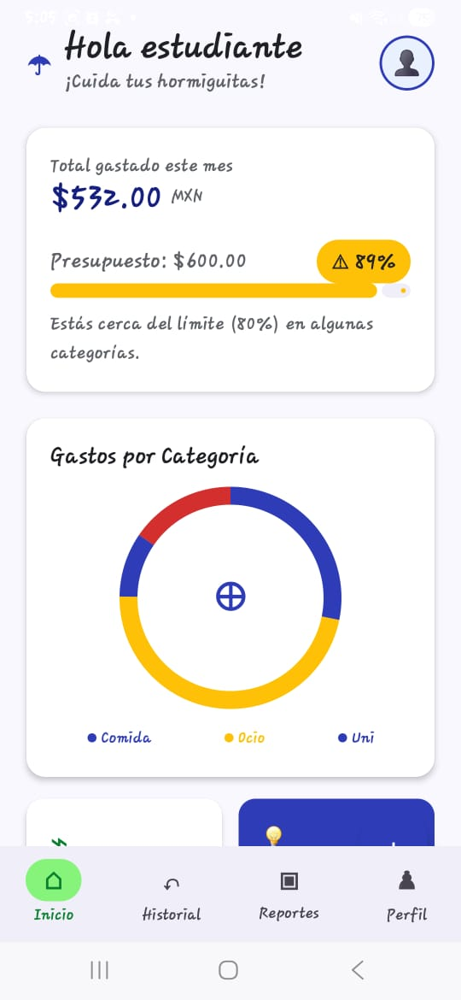
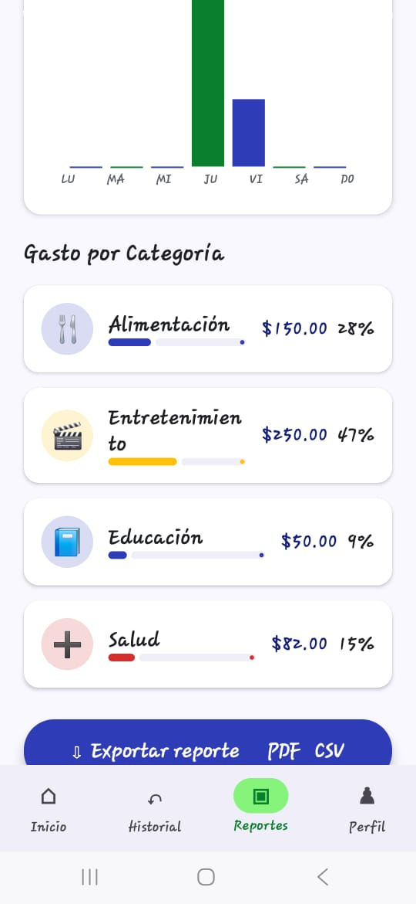
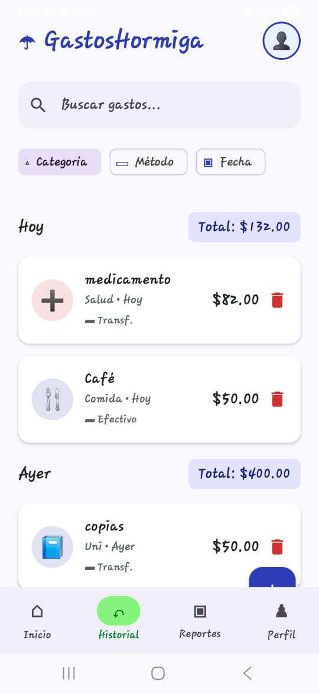
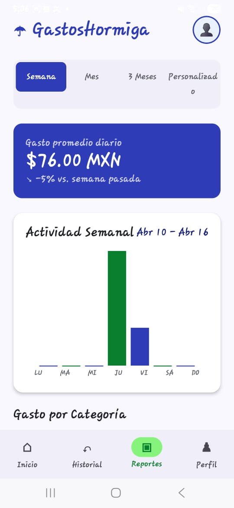
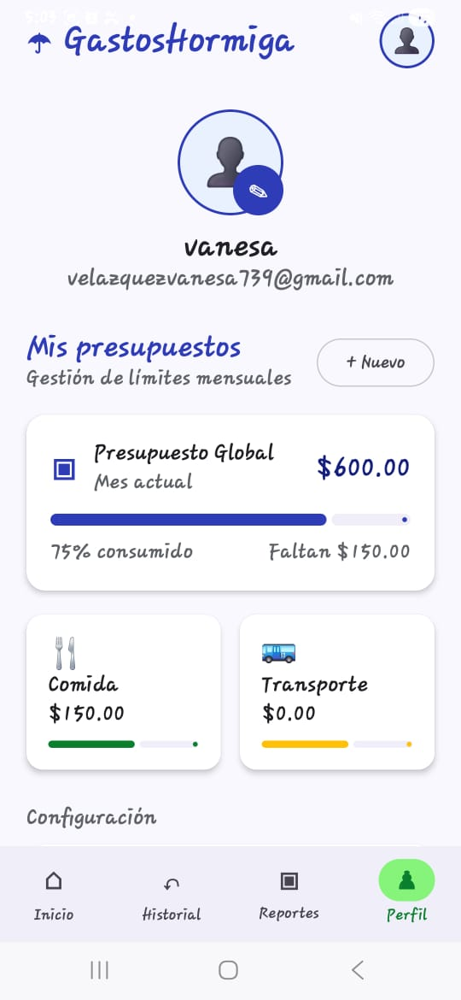

# 🐜 GastosHormigaApp

Aplicación móvil Android creada para ayudar a estudiantes universitarios a identificar, registrar y controlar sus **gastos hormiga**, es decir, pequeños gastos diarios que pueden afectar el presupuesto mensual si no se administran correctamente.

**GastosHormigaApp** permite registrar gastos de forma rápida, clasificarlos por categoría, revisar historial, visualizar reportes, consultar gastos recientes y configurar presupuestos para mejorar el control financiero personal.

---

## 📱 Vista previa de la aplicación

<p align="center">
  
  
  
</p>

<p align="center">
  
  
  
</p>

---

## ✨ Funcionalidades principales

- Registrar gastos hormiga desde el celular.
- Crear cuenta de usuario e iniciar sesión.
- Agregar gastos con monto, categoría, descripción, fecha, hora y método de pago.
- Organizar gastos por categorías como comida, transporte, ocio, universidad, salud, apps, ropa y otros.
- Consultar historial de gastos.
- Filtrar gastos por categoría, método de pago y fecha.
- Visualizar reportes semanales, mensuales o personalizados.
- Revisar gráficas de gastos por categoría.
- Configurar presupuesto mensual.
- Activar alerta al llegar al 80% del gasto permitido.
- Consultar últimos gastos registrados.
- Mantener la información guardada de forma local en el dispositivo.

---

## 🎯 Objetivo del proyecto

El objetivo de **GastosHormigaApp** es facilitar el control de pequeños gastos cotidianos, especialmente en estudiantes universitarios, ayudando a identificar en qué se está gastando el dinero y cómo esos gastos se acumulan durante la semana o el mes.

La aplicación busca fomentar una mejor organización financiera mediante una interfaz sencilla, visual y fácil de usar.

---

## 🧾 Secciones de la aplicación

### 🔐 Inicio de sesión y registro

Permite al usuario ingresar con una cuenta existente o crear una nueva cuenta con nombre, correo electrónico, contraseña y presupuesto mensual.

### 🏠 Inicio

Muestra un resumen general del gasto registrado, presupuesto disponible, porcentaje consumido y gastos principales de la semana.

### ➕ Nuevo gasto

Pantalla para registrar un gasto nuevo, ingresando el monto, categoría, descripción, fecha, hora y método de pago.

### 📋 Historial

Permite consultar los gastos registrados y organizarlos por día. También incluye opciones de búsqueda y filtrado por categoría, método de pago o fecha.

### 📊 Reportes

Muestra estadísticas de gastos por semana, mes, tres meses o periodos personalizados. Incluye gráficas y porcentajes por categoría.

### 👤 Perfil

Permite visualizar datos del usuario, revisar presupuestos, configurar alertas, editar presupuesto mensual y acceder a opciones de privacidad y cuenta.

---

## 🛠️ Tecnologías utilizadas

<p align="left">
  
  
  
  
  
  
  
</p>

---

## 🧩 Características del diseño

La interfaz fue diseñada con un estilo visual amigable y moderno, pensado para estudiantes universitarios.

- Colores principales en tonos azul, verde, amarillo y rojo.
- Diseño visual claro y organizado.
- Uso de tarjetas para mostrar información importante.
- Íconos representativos para cada categoría.
- Navegación inferior para acceder fácilmente a Inicio, Historial, Reportes y Perfil.
- Mensajes de apoyo para fomentar el ahorro y el control de gastos.

---

## 📂 Estructura general del proyecto

```text
GastosHormigaApp/
├── app/
│   ├── src/
│   │   ├── main/
│   │   │   ├── java/
│   │   │   ├── res/
│   │   │   └── AndroidManifest.xml
│   ├── build.gradle.kts
│   └── proguard-rules.pro
├── gradle/
├── screenshots/
│   ├── Bienvenida_GastosPrincipales.jpeg
│   ├── CreacionDeCuenta.jpeg
│   ├── GastosPorCategoria.jpeg
│   ├── Historial.jpeg
│   ├── Inicio-Registro.jpeg
│   ├── InicioDeSesion.jpeg
│   ├── Perfil.jpeg
│   ├── Reportes.jpeg
│   └── UltimosGastos.jpeg
├── build.gradle.kts
├── gradle.properties
├── settings.gradle.kts
└── README.md
```

---

## 🚀 Cómo ejecutar el proyecto

1. Clonar el repositorio:

```bash
git clone https://github.com/VanesaVR-creator/GastosHormigaApp.git
```

2. Abrir el proyecto en **Android Studio**.

3. Esperar a que Gradle sincronice las dependencias.

4. Ejecutar la aplicación en un emulador o dispositivo Android.

---

## 💾 Almacenamiento de datos

La aplicación utiliza almacenamiento local para guardar la información del usuario y sus gastos dentro del dispositivo.

Entre los datos principales se manejan:

- Usuario.
- Gastos registrados.
- Categorías.
- Métodos de pago.
- Presupuesto mensual.
- Historial de movimientos.

---

## 📌 Estado del proyecto

✅ Proyecto funcional  
✅ Interfaz visual implementada  
✅ Registro de gastos  
✅ Historial de gastos  
✅ Reportes y gráficas  
✅ Perfil de usuario  
✅ Base de datos local 

---

## 👩‍💻 Desarrollado por

**Vanesa Velázquez Rodríguez**

Proyecto desarrollado como práctica de aplicación móvil Android.

---
